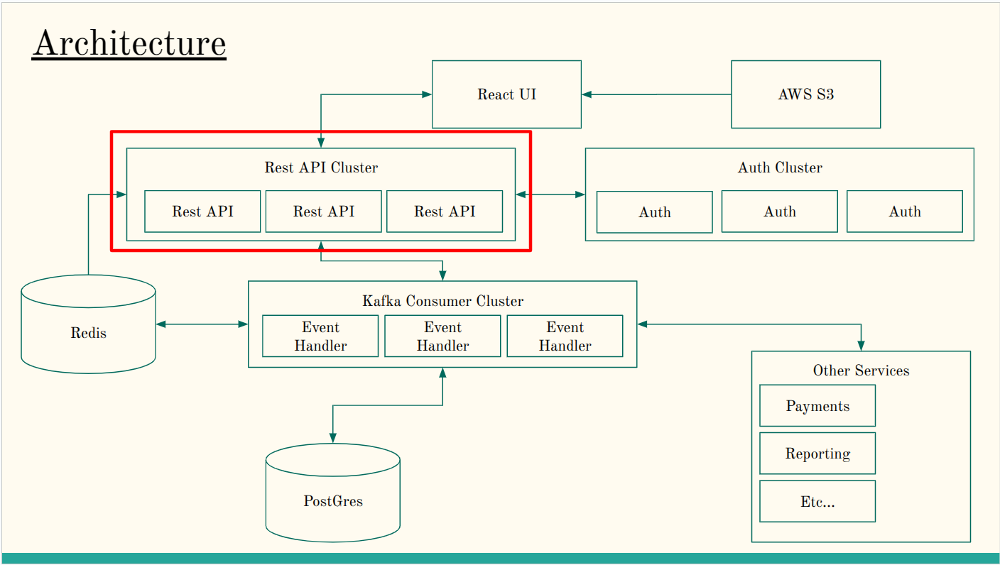

# fabacus-event-manager-api
Fabacus Event Management: REST API

# Service Overview

This is an API which supports the information flow for an event management system.  It is intended to be a component as a part of a collection of small micro-services which together would support the overall business needs.

It is expected that this would be deployed as a set of clusters with multiple instances of each application running.

Specifically this service provides the following services:

1. This app handles holding seats which is supported by a Redis instance.
1. This app accept requests for event creation and publishes a kafka message that the creation has been requested, but this ought to be moved into its own API (where the persistent schema would be defined and the data would be stored).
1. This API would normally interact with an Auth Service.

# API Documentation

The API is defined by a swagger.yaml file located here: [swagger.yaml](./swagger.yaml)

# Installation

Build the code
```bash
docker compose build
```

Run the services
```bash
docker compose up
```

Running tests
```bash
yarn test
```

# Architecture
The full architecture of the system can be seen here: 



# Dependencies

1. You must have docker installed to run this application.

# Contact

Author: Gerik Peterson
Email: Gerik@GerikPeterson.com / GGerikP1@Gmail.com

License: [MIT](./LICENSE)

